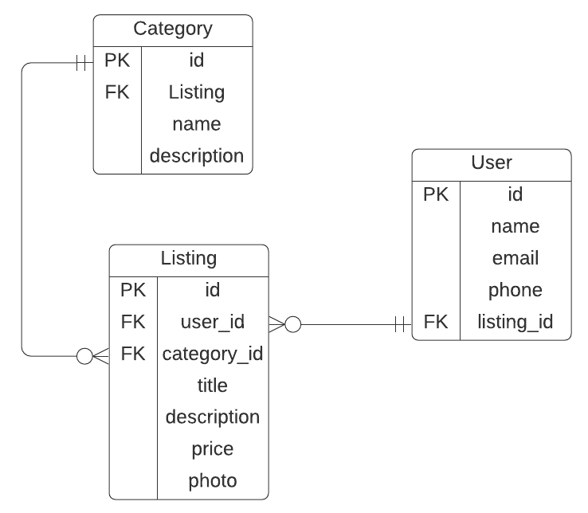

Nowadays computer parts are having new realeases so frequently that people find themselves switching to the new hardware very often. There is an abundance of used computer hardware that is still working. This platform will connect people who want buy/sell their used PC hardware.

This marketplace will help people to sell their used computer hardware and reduce waste. Buying second hand hardware is a big market especially now when the new parts are in deficit.

Link: https://shielded-scrubland-77362.herokuapp.com/

Github repo: https://github.com/Gleebo/marketplace_app

# Description
#### Purpose
The purpose of this application is to help people who want to buy or sell their used computer hardware to connect. Alos this is an excellent opportunity for me to learn how to use Rails.
#### Features
- Auth. The app has secure authentication and authorization , sing in, sign up implementation with Devise.
- Listings. Users can create, update, view and remove listings. Listings include title, description, image and price.
- Image upload. Users can upload an image to attach to their listing. The images are hosted on Cloudinary.
- Search. The app has a search functionality with keyword, category, price ordering and price range filtering.
- Online checkout. The app has an online checkout implementation with Stripe.

#### Sitemap

#### Screenshots

#### Target audience
People who want to sell/buy used computer hardware

#### Tech stack
- Rails
- PostgreSQL
- Tailwind
- Heroku
- Cloudinary
- Devise
- Stripe

# User stories
- As a PC owner I want a place to sell my old PC parts so that I can make room for new ones.
- As a PC owner I want to buy used PC parts so that I can upgrade my PC for less money.
- As a Marketplace user I want to sign up so that I can keep track of my listings.
- As a buyer I want to be able to search for a particular product at a particular price range.
- As a listing creator I want to be able to edit my listing so that I can change description/title/price/photo.
- As a buyer I want to be able to pay for my product online for convinience.
- As a seller I want to see a list of all of my listings in one place, so that I can manage them.

# Wireframes
to be added

# ERD

# Third Party Services
- Stripe. Stripe is used to handle the online payments.
- Heroku. The app is deployed on Heroku.
- Cloudinary. The image hosting for the app.

# Models and relationships
|Model|Relationship|Model|
|-|-|-|
|User|has many|Listing|
|Category|has many|Listing|
|Listing|belongs to|User|
|Listing|belongs to|Category|

# Database relationships
The database has 3 tables with the following rlations:
|Table|Relation|Table|
|-|-|-|
|User|one to many|Listing|
|Listing|one to many|Category|

# Schema
to be added

# Task allocation and tracking
To allocate and keep track of tasks I have created a Trello board with several cards. Each card represents the progress of a particular component of the proeject. At the end of the working day I update the cards appropriately.
(pictures to be added)